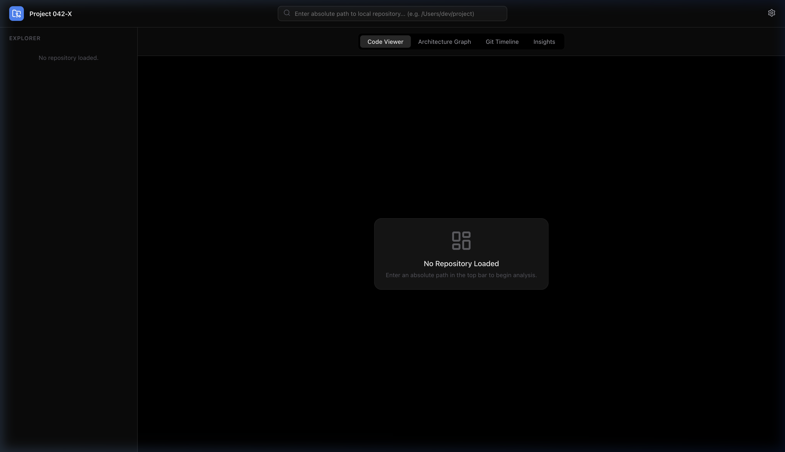
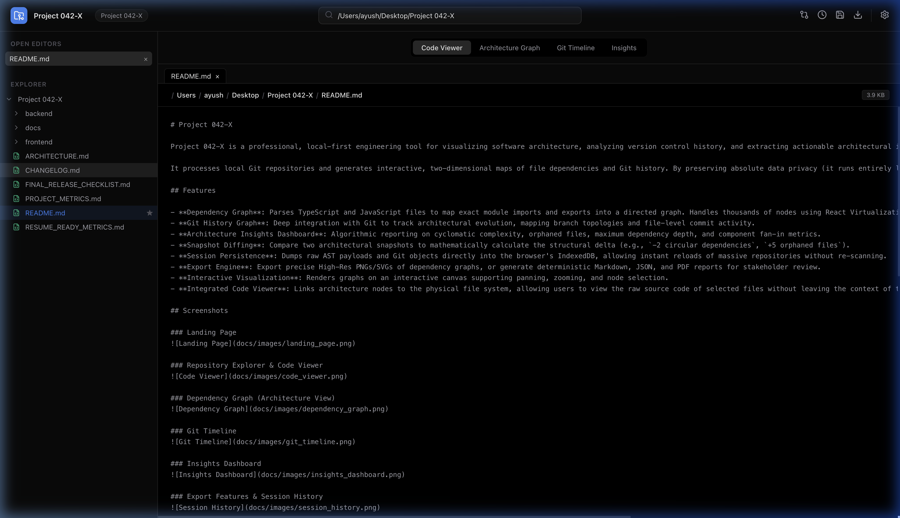
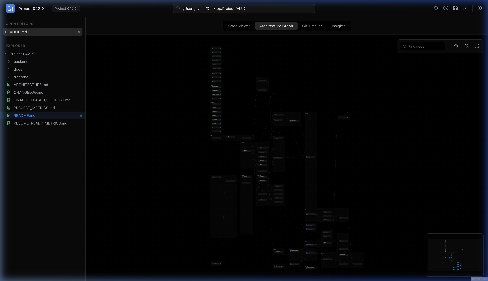
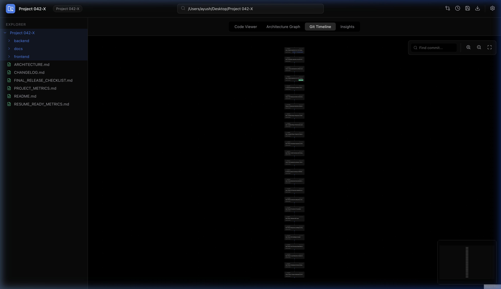
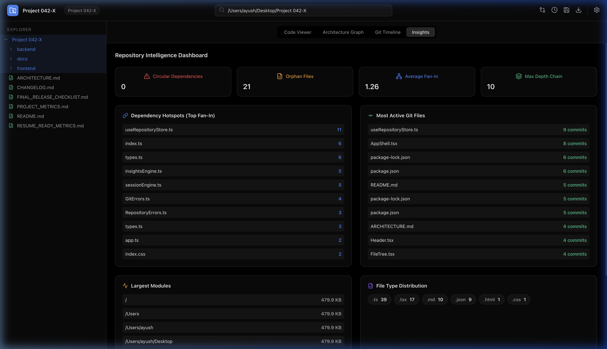
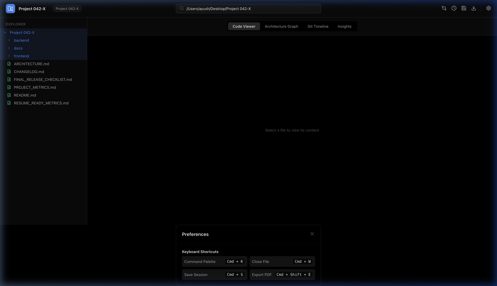
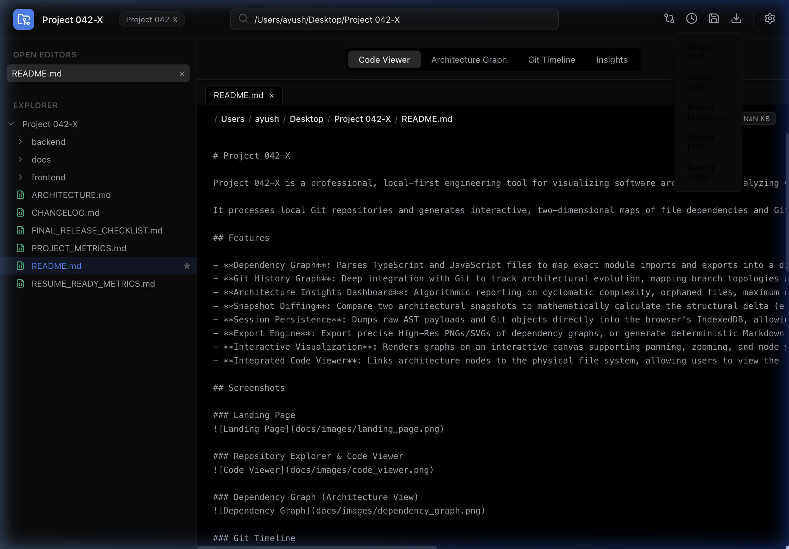

# Project 042-X

## Project Overview

Project 042-X is a high-performance repository intelligence engine designed to analyze, visualize, and extract actionable insights from large-scale codebases. It provides a real-time, interactive dependency graph, tracks architectural evolution through Git timeline integration, and calculates complex structural metrics like circular dependencies and component fan-in. 

Built with performance in mind, it analyzes ASTs natively using SWC and calculates graph spatial coordinates via Dagre, delivering a seamless experience even on enterprise-grade repositories.

## Key Features

- **AST-Driven Architecture Graph**: Accurately maps ES6 imports/exports into an interactive topological dependency graph.
- **Git Timeline Integration**: Visualizes commit history, branch topologies, and tracks file modification hotspots over the lifetime of the repository.
- **Insights Dashboard**: Calculates and flags circular dependencies, orphaned files, maximum dependency chains, and component fan-in.
- **Integrated Code Viewer**: Navigate directly from architectural nodes to the physical file system to inspect raw source code.
- **Zero-Configuration Persistence**: Saves repository snapshots seamlessly to the browser's IndexedDB, bypassing standard local storage limits.
- **Comprehensive Export Engine**: Export architectural snapshots to PDF, Markdown, JSON, SVG, and high-resolution PNG.

## Architecture Overview

Project 042-X operates on a localized Backend-for-Frontend (BFF) architecture. 

The **Node.js Backend** acts as a high-speed data processing pipeline. It utilizes `@swc/core` for native AST parsing and `simple-git` for version control extraction. It operates entirely in memory, streaming calculated data directly to the frontend without requiring an external database.

The **React Frontend** manages application state via Zustand. It utilizes `dagre` to perform mathematical graph layouts and `@xyflow/react` (React Flow) for high-performance rendering. Heavy analytical calculations (e.g., Tarjan's Strongly Connected Components algorithm for circular dependencies) are processed within the frontend's Insights Engine.

## Screenshots

### Landing Page


### Repository Analysis & Code Viewer


### Dependency Graph (Architecture View)


### Git Timeline


### Insights Dashboard


### Session History


### Export System


## Installation

Ensure you have Node.js (v18 or higher) installed on your system.

### 1. Setup Backend

Navigate to the backend directory, install dependencies, compile the TypeScript source, and start the server.

```bash
cd backend
npm install
npm run build
npm start
```
The backend server will run on `http://localhost:5001` (or your configured port). Ensure you have an `.env` file populated based on `.env.example`.

### 2. Setup Frontend

Open a new terminal window. Navigate to the frontend directory, install dependencies, and start the application.

```bash
cd frontend
npm install
npm run build
npm run preview
```
The frontend application will run on `http://localhost:4173`. For development, use `npm run dev` to start the Vite HMR server on port `5173` or `5174`.

## Quick Start

1. Start both the backend and frontend servers.
2. Open the frontend URL in your web browser.
3. In the top navigation bar, enter the **absolute path** to a local Git repository on your machine.
4. Press **Enter** to trigger the analysis engine.
5. Navigate through the **Code Viewer**, **Architecture Graph**, **Git Timeline**, and **Insights** tabs.

## Usage

- **Navigation**: Click on any node within the Architecture Graph to open the Node Inspector, which provides a direct link to open the file in the Code Viewer.
- **Search**: Use the Command Palette (`Cmd+K` or `Ctrl+K`) to quickly find and jump to specific files.
- **Persistence**: Click the "Save Session" icon to dump the current analysis into IndexedDB for instant retrieval later via the Session History panel.
- **Exporting**: Click the download icon to export the current view. Ensure the graph is positioned correctly before exporting to PNG or SVG.

## Supported Features

- Complete TypeScript and JavaScript AST parsing.
- Detection of circular dependencies and orphaned (unreferenced) files.
- Topological branch mapping and merge commit visualization.
- Dark-mode optimized, glassmorphic UI design.
- Local-first architecture (no data leaves your machine).

## Technology Stack

- **Frontend**: React 18, Vite, TypeScript, Zustand, React Flow (`@xyflow/react`), Dagre, `html-to-image`, `jspdf`, `idb-keyval`, Lucide React
- **Backend**: Node.js, Express, TypeScript, SWC (`@swc/core`), `simple-git`, Zod

## Project Structure

```text
Project 042-X/
├── backend/
│   ├── src/
│   │   ├── api/           # Express routes, controllers, and Zod validators
│   │   └── core/          # AST, Git, and Scanner engines
│   └── package.json
├── frontend/
│   ├── src/
│   │   ├── components/    # React components (Graph, Insights, Layout, Viewer)
│   │   ├── lib/           # Core frontend engines (Insights, Export, Storage)
│   │   └── store/         # Zustand state management
│   └── package.json
└── docs/                  # Architectural documentation and export specifications
```

## Performance Notes

- **Parsing Speed**: By leveraging SWC (Rust-based), AST generation is significantly faster than traditional JavaScript parsers (like Babel).
- **Layout Calculation**: The `dagre` layout algorithm runs synchronously. For massive repositories (5000+ files), this may cause a brief UI thread pause.
- **Rendering**: React Flow utilizes viewport virtualization. Ensure `fitView` is utilized when loading large graphs to prevent rendering off-screen elements unnecessarily.

## Known Limitations

- The AST engine currently only resolves ES6 `import`/`export` syntax. CommonJS (`require`) is not fully supported for graph generation.
- Repositories without a valid `.git` directory will fail the Git Timeline analysis phase.
- File sizes and metrics are calculated based on disk usage; symbolic links are not traversed to prevent infinite loops.

## Future Improvements

- Implementation of a WebWorker for off-thread `dagre` layout calculations to prevent UI blocking on extremely large codebases.
- Support for Python, Go, and Java AST parsing via language server protocols.
- Real-time file watching to incrementally update the graph upon local filesystem changes.

## License

This project is licensed under the MIT License. See the [LICENSE](LICENSE) file for details.
